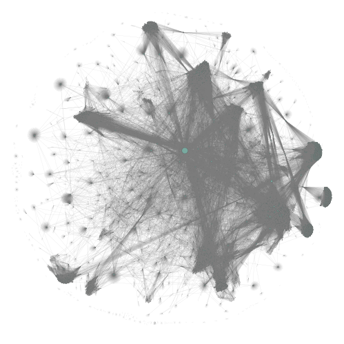
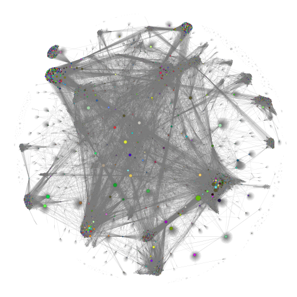

# Network

In this section we will go over the created networks and in depth analysis of the GitHub contributor network and based on the analysis draw conclusions.

## Basic Network Analysis 

Based on the data collected of the GitHub contributations (to read about data collection details click here: [Data](data.md))

To emphasize the how the dependabot is influencing the network structure and the size of the hub, we present a figure containing both the network structure with and without the dependabot. To further illustrate how the dependabot corrupt the network, the size of nodes are directly related to the degree of the node. 

<figure>
  <figcaption style="font-size: 2em;"><strong>GitHub Contributors Networks</strong></figcaption>
  
  <figcaption><em>Network Graph - Node size corresponding to node degree</em></figcaption>
  
  <figcaption><em>Network Graph without the bot - Node size corresponding to node degree</em></figcaption>
  <figcaption><strong>Fig1. - This is the network plotted with and without dependabot.</strong></figcaption>
   
</figure>

This illustration highlights that this bot node is clearly an outlier. This makes sense because it's a GitHub-provided bot designed to help repositories with tasks like monitoring for security vulnerabilities, which is especially beneficial for large companies that own many of these great repositories.
