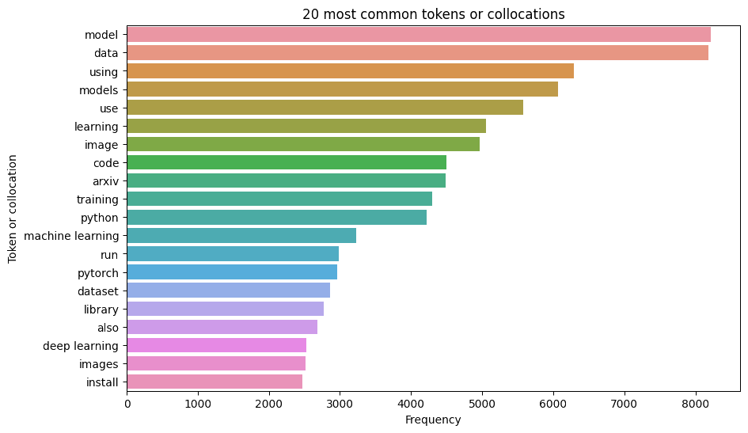
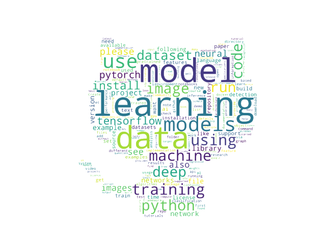

# Text

## Table of Contents

- [Text](#text)
  - [Table of Contents](#table-of-contents)
  - [Introduction and preprocessing](#introduction-and-preprocessing)
  - [Text analysis](#text-analysis)
  - [Advanced text analysis](#advanced-text-analysis)

## Introduction and preprocessing
In this section, we will focus on text analysis for the individual README.md included in each of the repositories. Some of the repositories have been filtered out since their README.md does not contain any English. The result of filtering out non-English repositories is going from 1509 total repositories to 1474. Furthermore, the files have been cleaned by removing parentheses, angle and square brackets, and the text inside of them. Additionally, URLs, HTML entities, Markdown syntax, code block, and inline code have been removed. Lastly, all digits, mathematical symbols, and punctuation have been cleaned out and the resulting text has been converted to lowercase.

## Text analysis
For the analysis of the now clean text, we first tokenized the text and then removed stopwords from it. Based on these tokens the possible bigrams and their frequency were computed. To determine possible collocations a chi-squared test was performed on the bigrams. In total, across all repositories, a total of 553 collocations were found. From hence on the registered collocations should be recognized as one term, and therefore the clean text was tokenized once more with all the collocations tokenized similarly to any other token. Based on this new tokenization the 20 most common tokens or collocations were found and displayed in [figure 3](#fig_freq).
<figure id="fig_freq">
    
    <figcaption><strong>Figure 3. - The 20 most common tokens and collocations</strong></figcaption>
</figure>
From [figure 3](#fig_freq) we see that many of the expected basic terms from machine learning and deep learning appear with high frequencies. Most interestingly, we see that the two topics that the repositories were filtered on appear as the only two collocations among the top 20 tokens or collocations.

## Advanced text analysis
For a more in-depth analysis of prominent tokens or collocations in the text, a TF-IDF analysis was performed. The tokens and collocations are sorted based on TF-IDF score from highest two lowest. From the top 200 tokens or collocations based on TF-IDF scores a word cloud in the shape of the GitHub icon is constructed and shown in [figure 4](#fig_wordcloud).

<figure id="fig_wordcloud">
    
    <figcaption><strong>Figure 4. - Word cloud of the top 200 tokens or collocations based on TF-IDF scores</strong></figcaption>
</figure>
